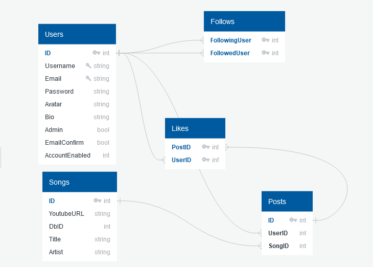

# Check Out This Song
### *A This Is My Jam clone*
 

*Check Out This Song* (*COTS*) is a lightly social music sharing web app inspired by [This Is My Jam](https://www.thisismyjam.com/) that allows users to post one song at a time that they feel that others should check out! *COTS* is my first capstone project for the Springboard Software Engineering program.

 

## API Selection:
Check Out This Song will use some or all of the following APIs to resolve user requests:

* Youtube Data API

        https://www.googleapis.com/youtube/v3/search

* Last.fm API

        http://ws.audioscrobbler.com/2.0/

## Database Design
COTS will use a relational database similar to the one described in the image below.

code for quickdatabasediagrams.com diagram

    Users
    -
    ID PK int
    Username string UNIQUE
    Email string UNIQUE
    Password string
    Avatar string
    Bio string
    Admin boolean
    EmailConfirm bool
    AccountEnabled bool

    Posts
    -
    ID PK int
    UserID int FK >- Users.ID
    SongID int FK >- Songs.ID

    Songs
    -
    ID PK int
    YoutubeURL string
    DbID int
    Title string
    Artist string

    Likes
    -
    PostID int PK FK >- Posts.ID
    UserID inf PK FK >- Users.ID

    Follows
    -
    FollowingUser int PK FK >- Users.ID
    FollowedUser int PK FK >- Users.ID

 
 

## User Flow

### Unregistered user

* When an unregistered visitor first visits the page the home page will have a short feed drawing from the most recent posts with the most likes.
* Nav at the top and prompt at the bottom to register or login
* Signup requires email, username, password, optional bio and (upload?) avatar
* Signup process should include email verification step
* Once signed up, use should be presented with a prompt to make a post
* Once posted successfully, takes user to detail page for that post

### Registered user

* etc

 

## Still to do

* Flesh out proposed user flows
* Set up organization of application
* 